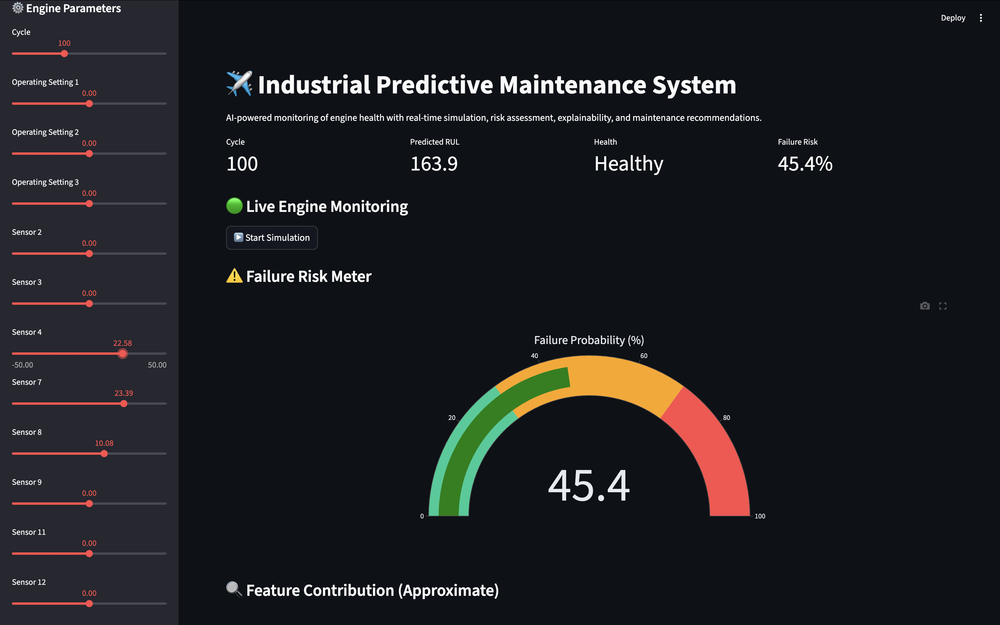
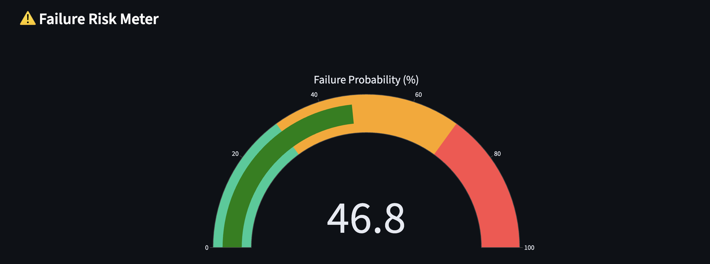
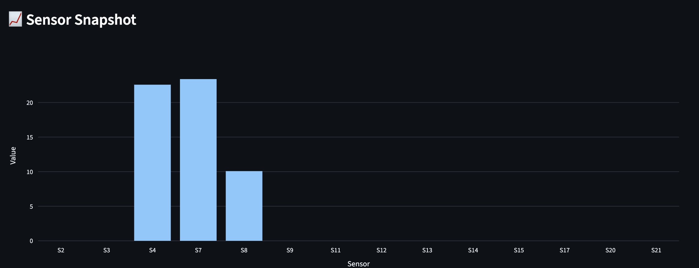

# Predictive Maintenance of Aircraft Engines using Machine Learning

## Overview

This project predicts the Remaining Useful Life (RUL) of turbofan
aircraft engines using NASA’s C-MAPSS dataset. The system simulates
an industrial predictive maintenance system with real-time monitoring,
failure risk estimation, and maintenance recommendations.

The goal is to demonstrate how machine learning can be applied to
prevent unexpected equipment failure and support Industry 4.0 systems.

## Problem Statement

Unexpected failure of critical machinery can lead to severe safety
risks and economic losses. Predictive maintenance aims to estimate
how long a component will continue to operate before failure.

This project focuses on predicting the Remaining Useful Life (RUL)
of aircraft engines based on sensor measurements collected over time.

## Dataset

The project uses the NASA C-MAPSS dataset, which contains simulated
run-to-failure data for turbofan engines.

Each engine is monitored through multiple sensors across operating
cycles until failure occurs.

Key characteristics:

- Multivariate time-series data  
- Multiple engines with different degradation patterns  
- Sensor measurements and operating conditions  
- Separate training and test sets  

Dataset source (original):  
https://ti.arc.nasa.gov/tech/dash/groups/pcoe/prognostic-data-repository/

Kaggle mirror used for download:  
https://www.kaggle.com/datasets/behrad3d/nasa-cmaps


## Objectives

- Predict Remaining Useful Life (RUL) of aircraft engines  
- Identify degradation patterns from sensor data  
- Estimate failure risk for maintenance planning  
- Demonstrate an end-to-end predictive maintenance system  

## Methodology

1. Data preprocessing and cleaning  
2. Feature engineering and normalization  
3. Remaining Useful Life (RUL) computation  
4. Model training using Random Forest regression  
5. Evaluation on unseen test engines  
6. Deployment through an interactive dashboard  

## Machine Learning Model

A Random Forest Regressor was used due to its ability to capture
nonlinear relationships and robustness to noise.

Features include selected sensor readings, operating settings,
and cycle information.

Performance was evaluated using RMSE and MAE on validation data.

## Technologies Used

- Python  
- Pandas, NumPy  
- Scikit-learn  
- Streamlit  
- Plotly  
- Matplotlib & Seaborn  

## Dashboard Features

- Real-time engine degradation simulation  
- Failure probability estimation  
- Risk classification (Healthy / Warning / Critical)  
- Feature importance visualization  
- Maintenance recommendations  
- Sensor data upload support  

## Results

The model successfully predicts Remaining Useful Life for unseen
engines and identifies high-risk conditions.

Evaluation metrics such as RMSE and MAE indicate reliable performance,
demonstrating the feasibility of machine learning for predictive
maintenance tasks.

The dashboard shows how these predictions can support maintenance
decision-making in real-world scenarios.

## Dashboard Preview

### Main Interface


### Real-Time Simulation


### Failure Risk Meter


### Feature Importance


### Sensor Snapshot


## Key Contributions

This project extends a standard predictive maintenance workflow
into a full decision-support system.

Unique aspects include:

- Real-time engine degradation simulation
- Failure probability estimation
- Interactive monitoring dashboard
- Explainable feature importance visualization
- Maintenance recommendation module
- Support for user-uploaded sensor data

## Design Decisions

- Random Forest was chosen for its robustness to noise
  and interpretability compared to deep learning models.

- Streamlit was used to enable rapid development of an
  interactive monitoring interface.

- Failure probability was derived from predicted RUL to
  provide actionable risk assessment.

  ## Challenges Faced

During the development and deployment of this project, several practical
challenges were encountered:

### Environment Setup and Dependency Issues
- Installing and configuring the Python environment on macOS (Apple Silicon)
  required careful package management.
- Missing libraries (e.g., pandas, plotly, jupyter) caused runtime errors
  that needed troubleshooting and installation within the correct environment.

### Tool Compatibility
- Ensuring compatibility between the training notebook and the deployment
  environment was challenging, especially for package versions and paths.
- Some libraries behaved differently across environments.

### Model Persistence and Loading
- Saving and loading the trained model required consistent preprocessing,
  including scaling.
- Incorrect file paths initially caused model loading failures in the
  Streamlit dashboard.

### Real-Time Simulation Implementation
- Designing a realistic degradation simulation in Streamlit required managing
  continuous updates without blocking the interface.
- Balancing responsiveness and computational load was necessary to ensure
  smooth visualization.

### Failure Probability Design
- Converting predicted RUL into an interpretable failure probability required
  designing a heuristic mapping, as the dataset does not directly provide
  probabilistic labels.

### Data Handling and Feature Alignment
- Ensuring that input features during inference exactly matched the training
  features (order and scaling) was critical to avoid incorrect predictions.

### Version Control and Deployment Issues
- GitHub rejected large model files due to the 100 MB file size limit,
  requiring removal of binaries and adoption of a reproducible workflow.
- Authentication issues arose due to GitHub discontinuing password-based
  Git operations, necessitating the use of Personal Access Tokens.

### Reproducibility Considerations
- To make the project portable, a requirements file and clear run
  instructions were needed so that others can rebuild the environment
  and regenerate the model.

These challenges reflect real-world machine learning development,
where integration, deployment, and usability issues are often as
important as model performance.


## Requirements

Python 3.10+  

### Installation
1. **Clone the repository:**
   ```bash
   git clone https://github.com/Devbanna/predictive-maintenance-rul.git 
   cd predictive-maintenance-rul

2. **Install Dependencies::**
    ```bash
    pip install -r requirements.txt

3. **Run the Dashboard:**
    '''bash
    streamlit run app/app.py


## RUL Definition

Remaining Useful Life (RUL) was computed as:

RUL = max_cycle − current_cycle


## Future Work

- Incorporating deep learning models  
- Using survival analysis for probabilistic failure prediction  
- Extending to multi-engine fleet monitoring  
- Deploying the system in cloud environments  

## Author Contribution

This project was independently designed and implemented by me as an
end-to-end machine learning application.

My contributions include:

- Understanding the predictive maintenance problem and selecting an
  appropriate dataset (NASA C-MAPSS)
- Performing data preprocessing, feature engineering, and RUL computation
- Designing and training the Random Forest regression model
- Evaluating model performance using standard metrics (RMSE, MAE)
- Developing an interactive dashboard using Streamlit
- Implementing real-time degradation simulation for engine monitoring
- Designing failure probability estimation and risk classification
- Creating visualization modules including feature importance analysis
- Implementing maintenance recommendations based on predicted risk
- Structuring the project for reproducibility and deployment
- Preparing documentation and usage instructions

All components of this project, including data processing, model
development, system design, and documentation, were completed independently.

## License

This project is intended for academic and educational purposes.

## References

NASA C-MAPSS Dataset  
https://ti.arc.nasa.gov/tech/dash/groups/pcoe/prognostic-data-repository/